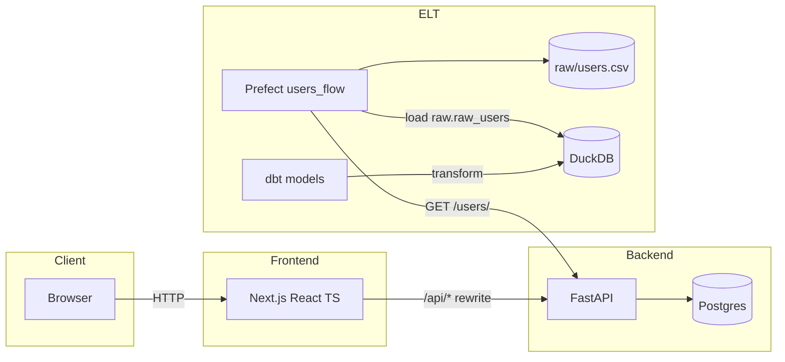

# Full‑Stack Python + ELT Monorepo

This repository contains a production‑ready learning/project scaffold to build:
- A FastAPI backend (REST API, auth-ready)
- A modern frontend (Next.js, coming next)
- A data ELT stack (Prefect + dbt, coming next)

## Structure

```
backend/   # FastAPI service
frontend/  # Next.js app (to be scaffolded)
elt/       # Prefect flows + dbt project
docs/      # Architecture and runbooks
```

## Architecture



More details in `docs/ARCHITECTURE.md`.

## Quickstart (backend only for now)

Prerequisites: Python 3.11+, Docker (optional for later), Make (optional)

```
cd backend
python -m venv .venv
source .venv/bin/activate
pip install --upgrade pip
pip install -r requirements.txt
uvicorn app.main:app --host 0.0.0.0 --port 8000 --reload
```

Visit: http://localhost:8000/healthz and /docs

## Roadmap (high‑level)
- Backend CRUD + Auth, DB migrations
- Frontend scaffold + auth flow
- ELT: Prefect orchestration + dbt models + data quality
- Docker Compose + CI/CD


