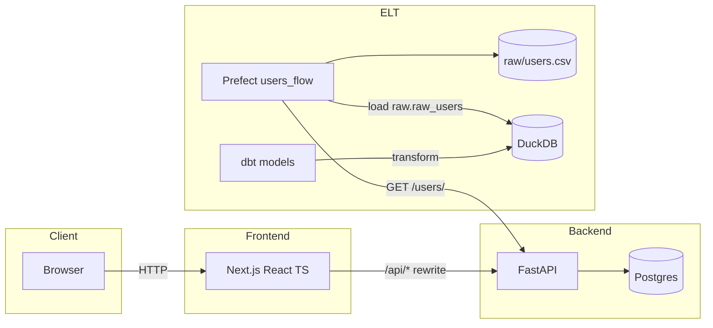

# System Architecture

## Notes
- Frontend uses Next rewrites to avoid CORS by proxying to the backend.
- Prefect extracts from the backend API, lands raw CSV, loads into DuckDB raw schema.
- dbt transforms raw tables into analytics schema tables.
- Docker Compose brings up `db`, `backend`, `frontend`, and `elt` services for local dev.

